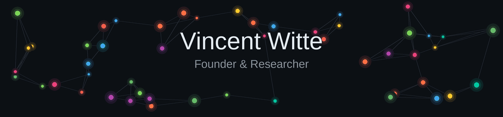

<!-- Banner: theme-aware. Drop your own banner.gif (dark) and banner_light.gif (light)
     in the root of your Dufius/Dufius repo. The uploaded GIFs say "Adam Alston",
     so replace them with your own before committing. -->
<a href="https://bringon.io/">
  <picture>
    <source media="(prefers-color-scheme: dark)" srcset="banner.gif">
    <source media="(prefers-color-scheme: light)" srcset="banner_light.gif">
    
  </picture>
</a>

### Languages

### Technologies

### Products

### Research

[-000)](https://github.com/Dufius)

### Security

